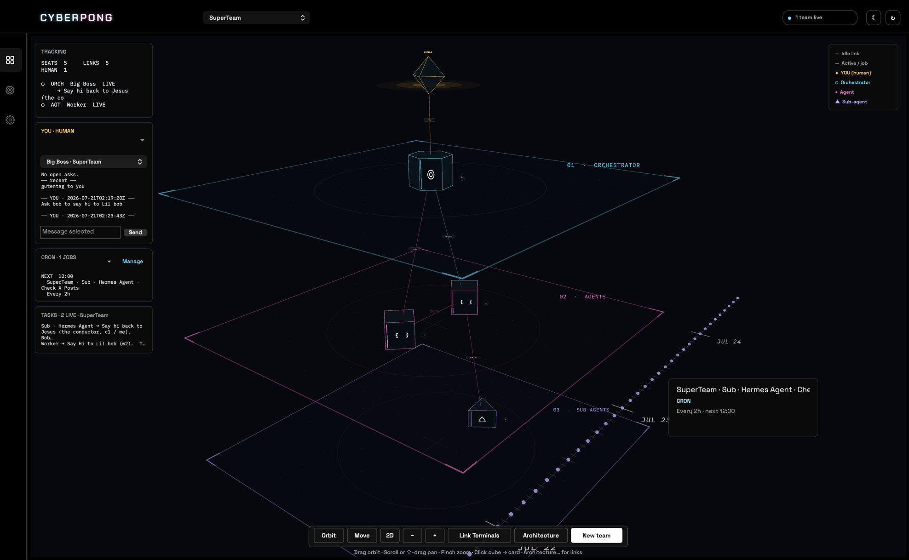
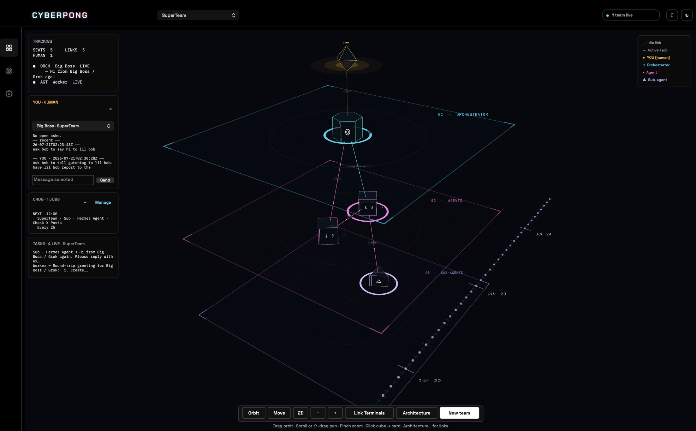
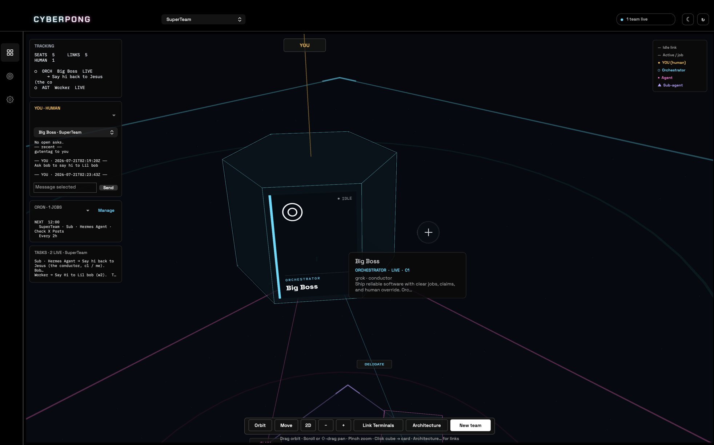
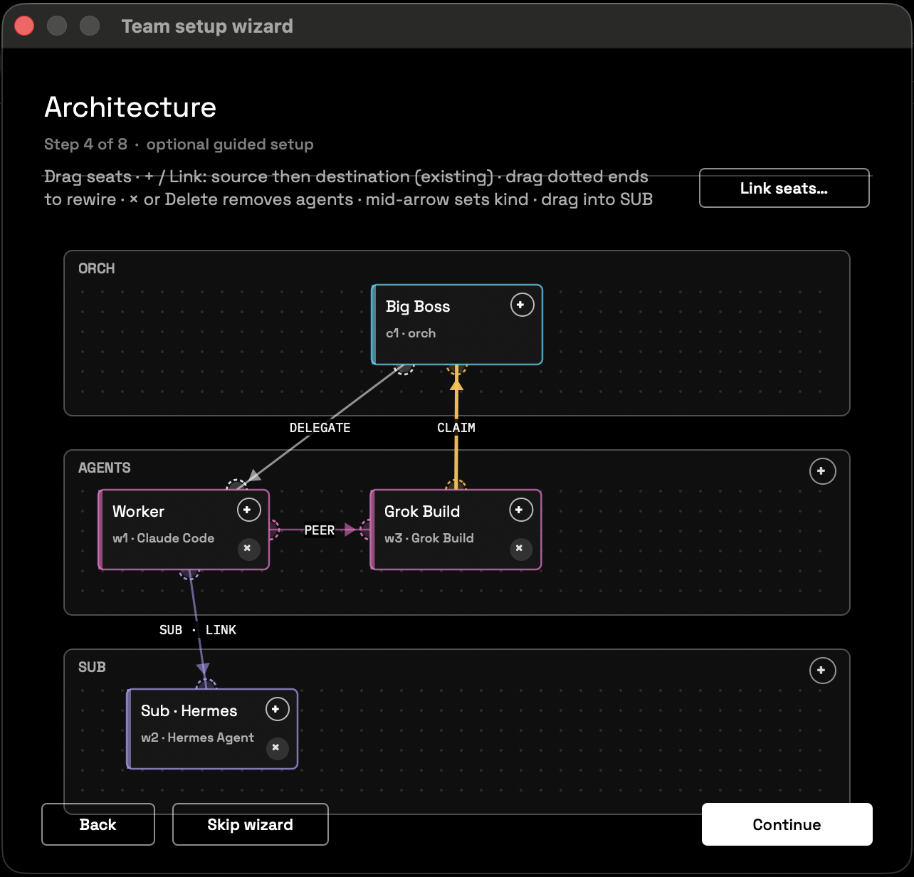
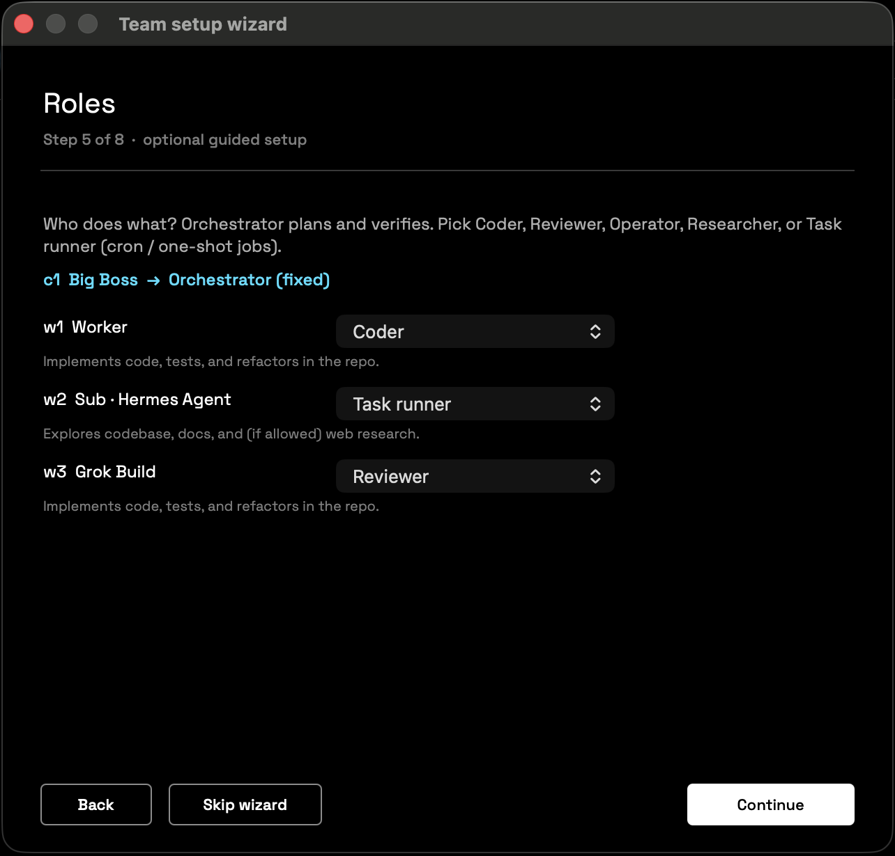

# CyberPong

**Local agent mission control for Mac.**

Say what you want done: an AI plans it as a **graph of steps**, your AI coding tools do the steps in real Terminal sessions on your Mac, and they ask you when a decision is yours.

The menu-bar app shows as **CyberPong**. The binary and CLI still say `Pong` for compatibility (`/Applications/CyberPong.app` → executable `Pong`, `pong` CLI, `~/.pong/`).

| | |
|--|--|
| **UI name** | CyberPong |
| **Repo** | [kulpio/CyberPong](https://github.com/kulpio/CyberPong) |
| **Version** | **2.0.0** |
| **AIs** | Claude Code, Grok Build, Codex, Hermes Agent; as team workers also Kimi, OpenCode or a custom CLI |
| **State** | `~/.pong/` (graphs, chats, teams, jobs, events, ledger; optional keys in `~/.pong/secrets/`) |
| **Platform** | macOS 13+, Apple silicon or Intel |

---

## What's new in 2.0

- **Questions you can answer without opening a file.** When a graph or a chat needs you, its card asks one short question, gives a few lines of context, and lists **What you're deciding**: the facts and the numbers behind it, each with a link to the file it comes from. The buttons say what they do. The points come from the work itself: the chat or the graph's designer writes them, or CyberPong and Claude Haiku do from the step's report and files (Settings › Limits & keys switches Haiku off). The files stay one click away.
- **A first-run setup.** It checks this Mac, signs in your AIs, picks the AI and model that plan your graphs, sets the limit and spending switches, and takes optional keys. Help › Set up CyberPong… runs it again.
- **Limits and keys.** Running graphs pause at Claude's 5-hour limit and pick up after the reset. Near the weekly limit you set (97% unless you change it) they stop until the reset, or until you press Resume anyway. Jev and Perplexity keys go in Settings › Limits & keys.
- **Graphs and chats.** New graph (⌘N) opens a chat that plans the graph with you, starts it and watches it. **Needs you** lists every question; **Graphs** shows every graph on the Mac, step by step.
- The app installs the `pong` command and its engine by itself, so a download needs no checkout; setup installs the graph runner with one button.

---

## What it can do

In plain language:

1. **Plan work as a graph** — Say what you want done. A planning chat turns it into steps (write, review, check, ask you), picks an AI and a model for each step, and starts it when you agree.
2. **Ask you only what's yours** — Needs you shows each question as a short card with the facts to decide and buttons that say what they do. The notch island shows them too.
3. **See every graph live** — The Graphs page shows each step, which AI runs it, what it produced, and its terminal.
4. **Build multi-agent teams** — Pick a conductor and staff workers from the CLIs you already use. Each seat is a real Terminal / tmux session you can open anytime; the 3D map shows who is on each team.
5. **Keep handoffs honest** — Jobs are files under `~/.pong/jobs/…`. Create, list, and inspect work from the CLI or the app. Progress isn't only "whatever got pasted into chat."
6. **Schedule work** — Everything that runs on its own, and when, on the Schedules page.
7. **Stay local** — Graphs, chats, teams, jobs, ledger, and events stay on your Mac. Optional Jev and Perplexity keys are stored only on this Mac (see [Privacy and keys](#privacy-and-keys)).

---

## Screenshots

| | |
|--|--|
|  | **Cron timeline** — jobs on the future axis |
|  | **Live seats** — active while work runs |
|  | **Orchestrator** — status and mission brief |
|  | **Architecture** — link orch, agents, and subs |
|  | **Roles** — coder, reviewer, task runner… |

---

## Quick start

### What a Mac needs

- **macOS 13 or newer.**
- **Apple's command line tools**, which bring Python 3.9 or newer: `xcode-select --install`.
- **Homebrew and tmux.** Every AI runs in a tmux terminal. Install Homebrew from [brew.sh](https://brew.sh) (one line in Terminal), then `brew install tmux`.
- **At least one AI command line tool, signed in.** For example Claude Code: `curl -fsSL https://claude.ai/install.sh | bash`, then `claude auth login`. Grok Build, Codex (`npm install -g @openai/codex`) and Hermes Agent work too.

You don't have to get these right first: the first-run setup checks each one and shows the fix for anything missing.

### Release zip

1. Download [CyberPong-macOS.zip](https://github.com/kulpio/CyberPong/releases/latest/download/CyberPong-macOS.zip) from [Releases](https://github.com/kulpio/CyberPong/releases/latest).
2. Unzip it, move **CyberPong** to your Applications folder, and open it.
3. If macOS says it can't check CyberPong or that Apple could not verify it (a build that isn't notarized), press **Done** (or **OK**), then open **System Settings › Privacy & Security**, scroll down to **Security**, press **Open Anyway** next to CyberPong, and confirm. You only do this once. If macOS then asks the same about **Pong Island** (the notch island inside CyberPong), do the same for it.
4. The [first-run setup](#first-run-setup) opens. Allow Accessibility and Automation for Terminal when macOS asks.

On first launch the app copies its engine to `~/.pong/lib` and writes the `pong` command (`~/bin/pong`), which needs Apple's command line tools (Python). To use `pong` in your own Terminal, add `~/bin` to your PATH:

```bash
echo 'export PATH="$HOME/bin:$PATH"' >> ~/.zprofile   # then open a new Terminal window
```

### From source

```bash
git clone https://github.com/kulpio/CyberPong.git && cd CyberPong && bash scripts/setup.sh
```

`scripts/setup.sh` checks for Python 3.9+ and tmux (it installs tmux with Homebrew when Homebrew is there, and says what to do when it isn't). It installs the engine, the `pong` command in `~/bin` and the graph runner. When this Mac can build the app (Apple's command line tools include `swiftc`), it builds it, copies it to `/Applications/CyberPong.app` and opens it; otherwise it points you to the release zip. It is safe to run again. Add `--with-skills` to also install the conductor skills (see [Skills](#skills)).

Then check the Mac (if your Terminal doesn't find `pong` yet, add `~/bin` to your PATH as shown above, or run `~/bin/pong doctor`):

```bash
pong doctor
```

### Rebuild the app after changes

```bash
bash scripts/build-app.sh
bash scripts/install.sh
```

That installs `/Applications/CyberPong.app` and launches **CyberPong**
(the Dock/Finder name). The binary inside the bundle is still named `Pong` for path compatibility. A build made on your Mac is signed for your Mac only; `scripts/sign-notarize.sh` makes the signed, notarized release zip. `scripts/sign-notarize.sh --sign-only` makes a zip signed with Developer ID but not notarized: people who download it press **Open Anyway** once (step 3 of [Release zip](#release-zip)).

Older Hermes Pong state moves over with `pong migrate` (`setup.sh` runs it for you).

---

## First-run setup

It opens the first time CyberPong starts. **Skip setup** closes it at any step, and **Help › Set up CyberPong…** (or Settings › AI accounts › Run setup again…) brings it back. After a welcome (what your AIs should call you), six short steps:

1. **Is this Mac ready?** — Python, tmux, the `pong` command, the graph runner, and the Accessibility and Automation permissions, each with a fix button where there is one. You can continue either way; it says plainly what won't work yet.
2. **Which AIs do you use?** — Sign in to each AI in its own Terminal window, with its own account (CyberPong never sees a password), and switch off the ones you don't use.
3. **Which AI plans your graphs?** — The AI and model the planning chat runs on, and whether the AIs may work without stopping to ask permission (Claude and Grok then use their own auto mode, which still blocks risky actions; Codex and Hermes may still stop to ask).
4. **Limits and spending** — Pause at Claude's 5-hour limit; stop near the weekly limit; the helper AI for questions and names (Claude Haiku, a little of your Claude allowance); Jev second opinions; Perplexity web research and its daily cap. Claude's own "usage credits" are shown, never changed.
5. **Keys (optional)** — A Jev key ([TypeSafe](https://typesafe.ai)) and a Perplexity key ([perplexity.ai/settings/api](https://www.perplexity.ai/settings/api)). Each is saved only on this Mac and never shown again.
6. **You're set** — What's ready and what isn't, then **New graph…** for your first piece of work.

What it asks lives on in Settings: your name in **General**, your AIs and the AI that plans your graphs in **AI accounts**, limits and keys in **Limits & keys**.

---

## In the app

1. **New graph** (⌘N) — Say what you want done. A chat plans it with you as a graph of steps, picks an AI and a model for each step, and starts it when you agree.
2. **Needs you** (⌘1) — Answer the questions only you can. Each card shows the question, what you're deciding and buttons that say what they do.
3. **Graphs** (⌘3) — Watch every graph step by step: which AI runs each step, what it wrote, its terminal.
4. **Chats** (⌘2) — Go back to a planning chat to change a graph or start another one.
5. **Teams** (⌘4) — Who is on each team and what each AI is doing; **New team** (⇧⌘N) builds a lineup by hand. Open any seat's Terminal when you want to step in.
6. **Schedules** (⌘5) — Everything that runs on its own, and when.

---

## Privacy and keys

- Graphs, chats, teams, jobs, ledger and events stay on your Mac, in `~/.pong/`.
- Each AI tool keeps its own sign-in. CyberPong never sees a password.
- Optional Jev and Perplexity keys are stored only on this Mac, in `~/.pong/secrets/` (folder readable only by you, mode 0700; files 0600). `pong keys status` says whether each one is set, never the key. Settings › Limits & keys removes them.
- What leaves the Mac: the work goes to the AIs you chose, as when you use them yourself. A Jev second opinion sends the step's documents to Jev (TypeSafe). A Perplexity research step sends its question; a question holding an email address, a phone number or a key is refused. The helper AI (Claude Haiku, through your own Claude Code) reads the work's files to write the questions in plain words; it never reads key or password files, or the hidden files and folders in your home folder other than CyberPong's own work notes in `~/.pong`, and Settings › Limits & keys switches it off.

---

## CLI (control plane)

```bash
pong status
pong gate                          # BRIDGE_ON / OFF
pong check                         # foundation self-check
pong snapshot                      # JSON the panel reads
pong job create --worker w1 --task 'Implement login. Tests must pass.'
pong job create --worker w1 --task '…' --no-paste
pong job list
pong job show job_…
pong events -n 20
pong ledger record --task-id T1 --round 1 --verdict accept --evidence 'npm test ok'
```

### Setup, keys and limits (2.0)

```bash
pong doctor                          # is this Mac ready: Python, tmux, the pong command, the runner, each AI, the keys
pong runtime install-agent           # install (or restart) the graph runner, a launchd agent
pong keys status                     # Jev and Perplexity: set or not, never the key itself
pong keys set --name perplexity      # reads the key from stdin, never from an argument
pong jev key test                    # one trivial call: works, key refused, unreachable or no key
pong limits status                   # what the runner is holding for Claude's limits
pong limits resume                   # lift the limit pauses now (the app's Resume anyway)
pong -s <team> ask new -q 'Send the plan to the client?' -o 'Yes::sends it today' -o 'No::keeps it as a draft' \
  -d 'The plan raises the price 12%::plan.md::Pricing'    # a question on Needs you, with what you're deciding
```

### Seat availability + delivery waitroom

Every seat is **busy** or **available**. Pastes only when the target is **available**. Map visual "active" is never the gate. Bias: **hold when unsure** (false busy > false idle). **No starvation:** free seats auto-flush without the human asking the orch for updates.

| Rule | Behavior |
|------|----------|
| Job pasted to worker | Worker → **busy** until claim/done |
| Worker claim/done | Worker → **available**; claim enqueued for c1 |
| Claim digest paste to c1 | **Does not** stick c1 busy forever (grace only blocks double-paste) |
| Human YOU → orch paste | c1 → busy `human` (~15 min TTL, then auto-free) |
| Claim / job while busy | **Queued** — no TUI interrupt |
| Panel snapshot poll | `try_deliver` for any non-empty queue when seats free |
| Soft inbox | YOU panel / map: `Claims waiting: N` from `waitroom_queued` |

```bash
pong seat status                       # busy reason + queue depth + free_in when TTL
pong seat busy --seat c1 --reason verifying
pong seat available --seat c1          # also try_deliver
pong waitroom list
pong waitroom try-deliver              # flush available seats only
pong waitroom drain                    # mark ready + deliver
pong waitroom drain --force
pong job create -w w1 -t '…' --force-paste
pong job claim <id> --notify-paste
# PONG_CLAIM_PASTE=1 · PONG_FORCE_JOB_PASTE=1 · PONG_HUMAN_BUSY_SEC · PONG_CLAIM_DIGEST_BUSY_SEC
```

State: `~/.pong/sessions/<session>/seat_status.json`, `waitroom.json`.

### The graph interview in Terminal (1.6.0)

```bash
pong graph new                       # in a terminal: eight plain questions → a proposal → Start
pong graph new --answers a.json --start     # the same, non-interactive (see `pong graph questions`)
pong -s <team> goal resume --id g_…          # continue a loop that stopped to show you
pong -s <team> goal pause  --id g_…          # hold one
```

Since 2.0 the app's and the island's **New graph** open a planning chat instead; the interview stays in Settings › Advanced › The old interview. The
questions: what it should achieve · what kind of work · how we know it is done
(a command must pass, it must match an example, or you judge it) · who sees the
result · how careful (thorough / balanced / fast and cheap) · when it should
stop and show you (after every round / when it passes / only when done or
stuck) · which platforms · a new team of its own or under one of your mains.

A deterministic composer turns the answers into a loop from the catalog with
its rounds, boundaries and wiring; Claude (the installed CLI, one turn, no
tools, no key) then refines it inside the fields the schema allows, and every
change carries a reason. You see the proposal and press Start. "A new team of
its own" writes a team with a lead seat routed by the solver (Fable), its
token, and a tmux session when tmux is up; "a command must pass" becomes the
critic's bar, written to a file the critic re-runs.

### Loops, wiring, and the runner (1.5.0)

A goal becomes a graph, the graph is wired to platforms by a solver, and a
runner ticks it without the panel. Every assignment carries its reason and the
reason every other platform was not chosen.

```bash
pong -s <team> wire plan --loop gauntlet --owner w7 --task 'Ship the seat-busy TTL. Run the tests.'
pong -s <team> goal start --owner w7 --loop gauntlet --task '…' --example https://… [--pin critic=claude] [--client-facing] [--agency gated]
pong graph examples                                   # bundled graph-loop topologies (brain-loop, …)
pong -s <team> graph attach --owner w7 --file python/pong/loops/graphs/brain-loop.json --pin '*=grok'   # a graph you describe: nodes, edges with on:, cycles bounded by max_rounds, a human gate
pong -s <team> goal resume --id g_… --outcome approved|rejected                          # take an edge out of a human gate
pong -s <team> goal status | goal tick | goal cancel --id g_… | goal delete --id g_…
pong model list                      # runtimes, models, strengths, what is installed
pong model plan --role critic 'score the artifacts'
pong pool show | pong pool set xai 0.62   # shared weekly allowance the solver keeps heavy work off
pong mailbox peek --seat w7          # durable child-done / round / refusal items for a main
pong drain [--watch]                 # harvest + waitroom + goal ticks + snapshot, panel or no panel
pong cron tick | cron status | cron add --name … --cadence 'every 1h' --owner w6 --task '…'
pong runtime run --no-cron           # what the launchd agent runs
pong runtime install-agent           # com.cyberpong.runtime: drain + goal ticks every 30 s (CRON=1 to fire schedules)
```

Policy is data: `python/pong/models/catalog.json` holds runtimes, models,
strengths, boundaries, demand markers and ordered rules (machine override at
`~/.pong/models/catalog.json`, team override under the session). The island's
**Runs on** rows and `goal start` read the same solver, so the preview cannot
disagree with what gets spawned. A critic that claims without saying win or
fail is counted as **fail** and recorded as a refusal; the owner's mailbox gets
one item per round and one when the loop stops. Schedule rows whose wording
would send, publish, spend or deploy are gated to draft-only unless the row
declares `allow_effects: true`.

The UI is built on **`pong snapshot`**. Details: [`docs/UI-CONTRACT.md`](docs/UI-CONTRACT.md).

Architecture notes: [`docs/ARCHITECTURE.md`](docs/ARCHITECTURE.md)  
Agent vocabulary / north star: [`docs/NORTH-STAR-AGENT-HANDOUT.md`](docs/NORTH-STAR-AGENT-HANDOUT.md)

Compat aliases: `pong-delegate.py`, `claude-delegate.py`, `pong-gate.py`.

---


## Graph loops

The full contract, the templates and the Graphs page: [`docs/GRAPH-LOOPS.md`](docs/GRAPH-LOOPS.md). The research behind graphs: [`docs/research/`](docs/research/).

### 1.6.0 notes

The five fixed shapes (`fan`, `join`, `router`, `cycle`, `gauntlet`) are what most work needs. A **graph loop** is one you describe: nodes with a role (`operator`, `scout`, `researcher`, `writer`, `builder`, `critic`, `router`, `human`, `join`), edges with a condition (`done`, `fail`, `win`, `approved`, `rejected`, `route:<label>`, `*`), cycles bounded by `max_rounds`, and a `human` node that pauses the graph until a person takes an edge out of it (`goal resume --outcome approved|rejected`). The runtime lints the topology before anything is spawned (unknown node, unreachable node, bad condition, unbounded rounds are refused), routes on each claim's outcome (`win`/`fail`/`route:x` at the start of the claim summary, or `result.next`), and stops with a named reason (`failed_bounded:rounds`, `no_edge:<outcome>`) rather than silently.

In the interview (`pong graph new`) answer *A graph loop I describe* and type the stages:

```
gather -> synthesize <-> grade -> me -> done
```

`->` goes on when done, `<->` loops back on fail (the right-hand stage becomes the critic), `me` is you, `done` ends it. Every node is wired by the same solver as the fixed shapes, so each one shows the platform, the model and the reason; `--pin '*=grok'` steers the whole loop to one platform. The map draws the graph under the lead seat with its `ON …` edges.

## Skills

```bash
bash scripts/install-skills.sh          # Grok + Hermes
bash scripts/install-skills.sh grok
bash scripts/install-skills.sh hermes
```

| Skill | Role |
|-------|------|
| `pong-bridge` | Generic conductor protocol |
| `grok-pong-bridge` | Grok as conductor |
| `hermes-pong-bridge` | Hermes as conductor |

---

## State

| Path | What |
|------|------|
| `~/.pong/` | Primary state (graphs, chats, teams, jobs, events, ledger) |
| `~/.pong/settings.json` | What the setup and Settings chose (your name, AIs, limits) |
| `~/.pong/secrets/` | Optional Jev and Perplexity keys (0700 folder, 0600 files) |
| `~/.pong/lib/` | The engine the `pong` command and the graph runner use |
| `~/.hermes-pong/` | Legacy read path |

Env on team panes: `PONG_SESSION` (legacy: `HERMES_PONG_SESSION`).

---

## Landing page

Marketing site sources live in [`landing/`](landing/). Deploy that folder (e.g. Vercel or GitHub Pages) for the public page.

Brand kit (mark, wordmarks, favicons): [`brand/`](brand/) and [`resources/brand/`](resources/brand/).

---

## Version

**2.0.0** — Ready for other Macs. Questions come as short cards that say what you're deciding, with the facts and their files, and buttons that say what they do (gates, chat questions, the island, notifications). A first-run setup and new Settings panes: this Mac's checks with fixes, AI sign-ins and switches, the AI and model that plan your graphs, permission mode, limits and spending, Jev and Perplexity keys. The graph runner rides out Claude's 5-hour limit and stops near the weekly limit you set. The app installs its own `pong` command and engine; `pong doctor`, `pong keys`, `pong limits` and `pong runtime install-agent` are new. Also in this release, since 1.7: graphs are planned and run from chats with an architect (New graph, ⌘N), every graph keeps a full log, and the app is redesigned around a sidebar of Needs you, Chats, Graphs, Teams and Schedules.

**1.7.0** — Graph loops the way the labs build them. The app opens on a **Graphs** page: every graph on the Mac in one 3D scene with three altitudes (Orbit, Wiring, Seat), an inspector that says who runs each node and why, gates you answer with a note, and a live view of any seat. The engine (`pong/graph_engine.py`): the most specific edge wins; critics must give a verdict and see artifacts, not the builder's account; engine-run `check` nodes with protected files and a no-progress stop; barrier joins with judge-panel rules; `error` kept apart from `fail`; retries, timeouts, wall/job budgets, `bounded` edges to a person; K copies of a node; notes and team lessons across rounds. Six templates from the 2026 research (`pong graph examples`). The runner now drains every team, fresh seats start on their job with no paste, tokens stay out of shell history, stale pane ids can no longer point at another seat. See [`docs/GRAPH-LOOPS.md`](docs/GRAPH-LOOPS.md).

**1.6.0** — `pong graph new`: a graph designed from eight questions, refined by Claude, started by you; a graph can be a team of its own; `pause_on` (round / win / done) with `goal pause` / `goal resume`; efficiency tiers; per-graph platform allow-list; the writer role.

**1.5.0** — Loop wiring: platforms chosen per node by a data catalog (why and why-not), island **Runs on** rows, mailbox, runner (`pong runtime`), gated cron, ambiguous critic = fail, live-session polling (no refusal storm), 45 s starting TTL for spawned seats.

**1.4.4** — New team / wizard always-dark (readable in light mode); terminal drag-select + copy for all agent CLIs (Hermes, Claude, Codex, Grok…); team-scoped session vault titles and continuity picker filter.

**1.4.0** — CyberPong brand, multi-CLI teams, 3D mission map, architecture editor, cron timeline, human console, job control plane.

Formerly shipped as Hermes Pong (through 1.3.x).

---

## License / privacy

Teams, graphs, chats, jobs and the ledger stay on your Mac. Optional Jev and Perplexity keys are stored only on this Mac, in `~/.pong/secrets/` (mode 0600); your AI tools keep their own sign-ins. See [Privacy and keys](#privacy-and-keys).
